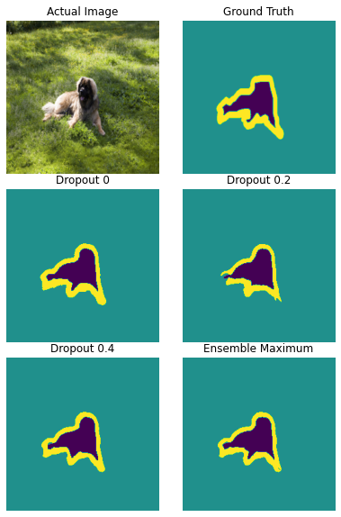
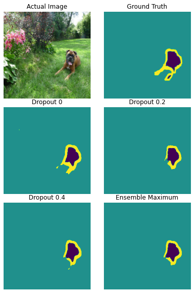

# Semantic Segmentation on The Oxford-IIIT Pet Dataset

## Dataset
https://www.robots.ox.ac.uk/~vgg/data/pets/  

O. M. Parkhi, A. Vedaldi, A. Zisserman, C. V. Jawahar  
Cats and Dogs   
IEEE Conference on Computer Vision and Pattern Recognition  

## Model
A U-Net based neural network was trained from scratch using Pytorch Lightning wrapper over the Pytorch Framework.

The dropout probability was varied to optimise the network.

### Optimiser 
Adam with the default learning rate of 1-3.

### Loss   
Cross Entropy Loss of classified pixel labels and ground data.

### Callbacks
Early Stopping , Best Validation loss checkpoints.

## Datasets

Datasets folder contain the Train|Validation|Test split on the dataset.

## Test Examples

The **tester.ipynb** contain the testing notebook and can be used to generate more test samples. 
Some of the best test examples are in Sample Images folder.

Sample1            |  Sample 2
:-------------------------:|:-------------------------:
  |  

## Tensorboard 

Loss values can be found in the tensorboard logs.

> tensorboard --logdir runs/

## Model Checkpoints
Model weight checkpoints are saved in **CKPT** folder
